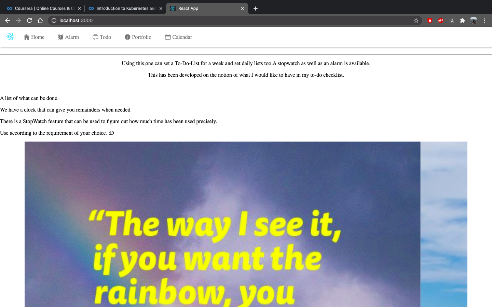
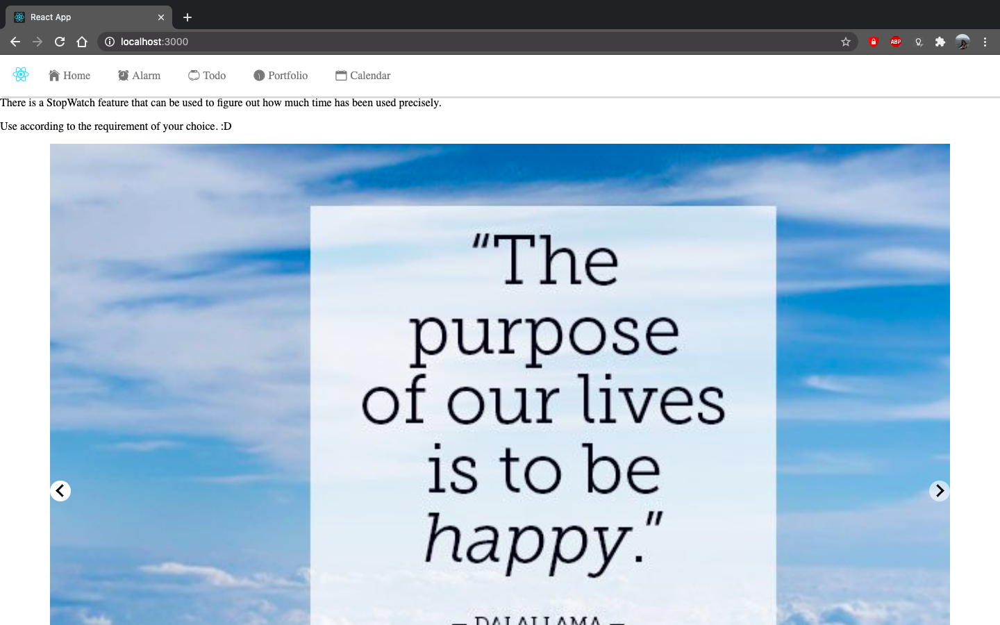
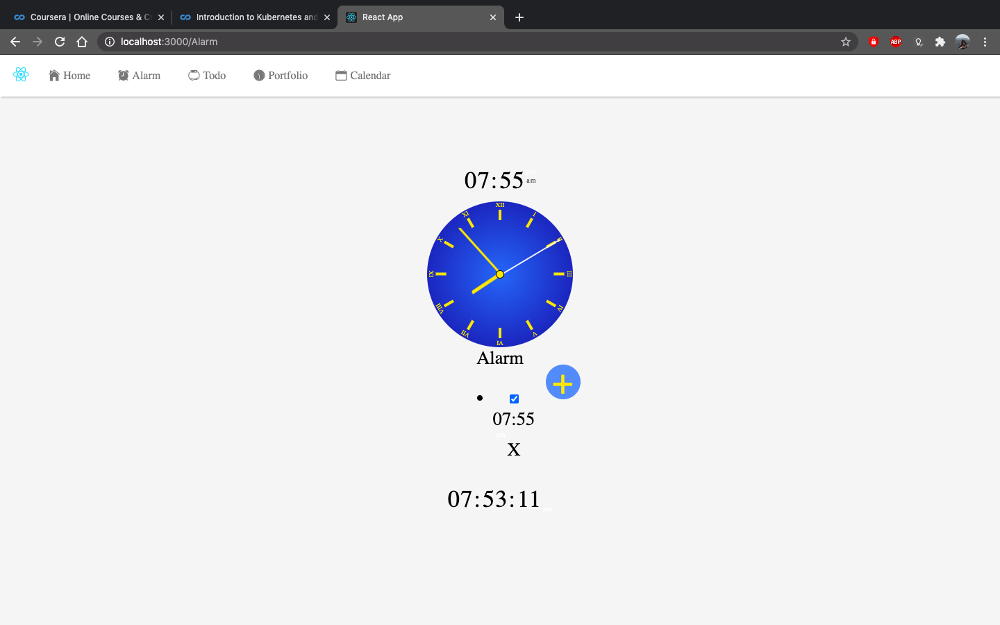
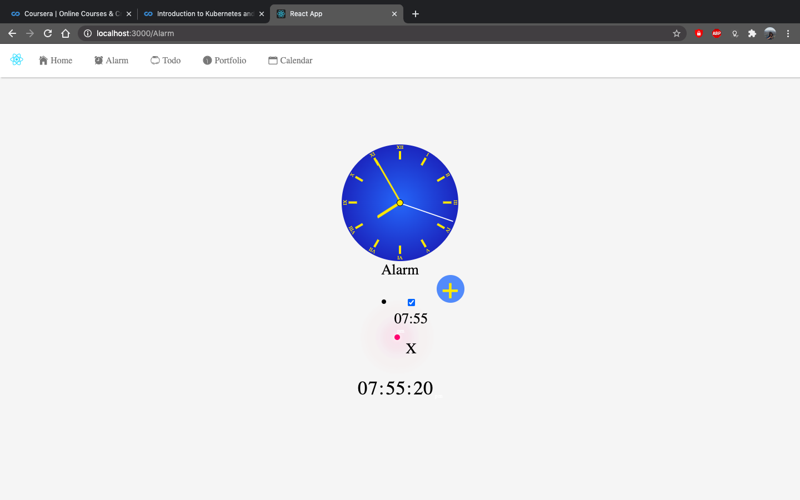
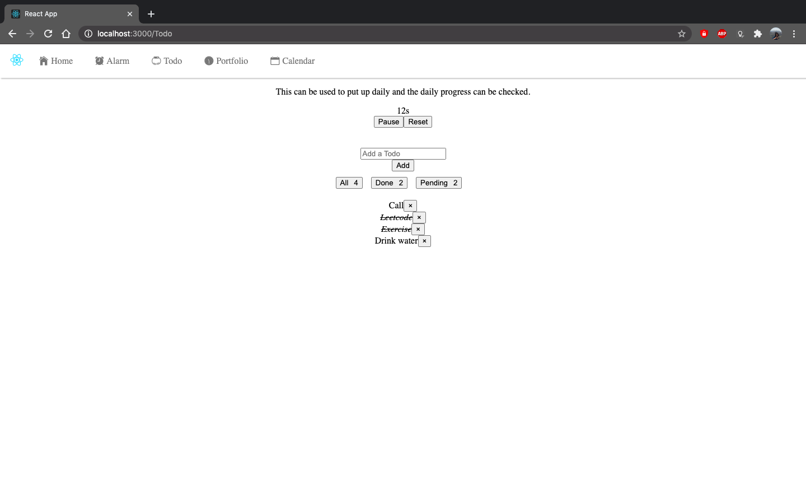

# Productivity

It helps in creating a To-do-list which helps in storing the tasks that are to be done.It also has an alarm and stopwatch which can help you to inrease one's productivity,with some beautification that is done which includes sliedshow of motivating images and a navigation bar to move between tasks.

A slide show of images can also be added.

The clock helps in setting a timer for when you need to set a goal that has to be done quick.A red light blinks when the goal is done.

The Tasks to be done,the pending tasks and the tasks that are over can be seen in this.The tasks that are done can be crossed over.

